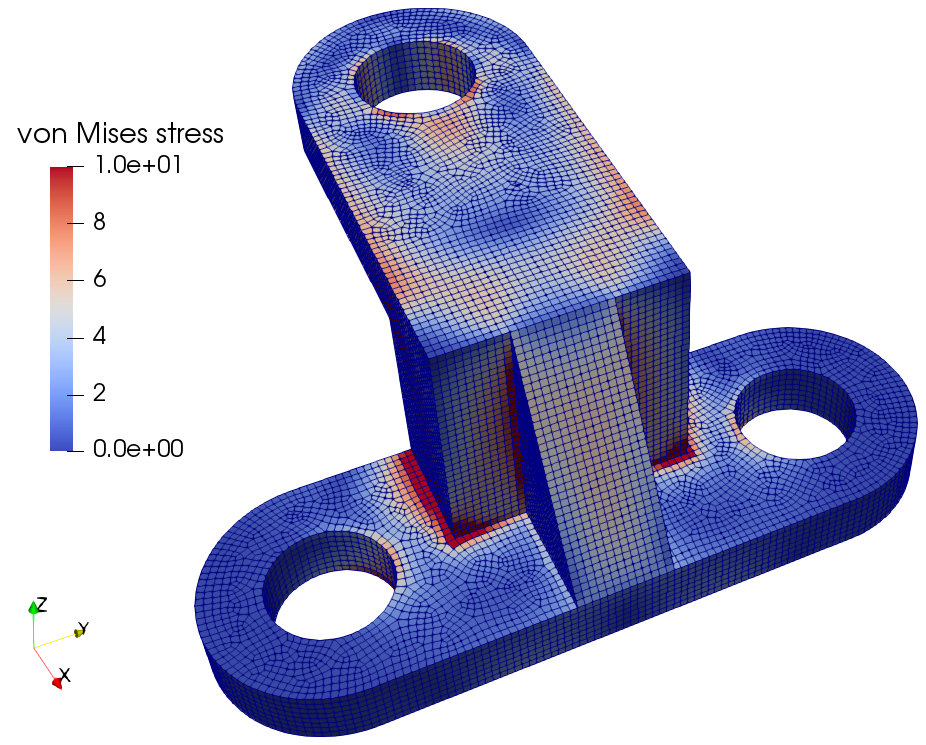

.. jax-fem-docs documentation master file, created by
   sphinx-quickstart on Thu Jul  3 15:46:45 2025.
   You can adapt this file completely to your liking, but it should at least
   contain the root `toctree` directive.

Welcome to JAX-FEM's documentation!
===================================

.. Add your content using ``reStructuredText`` syntax. See the
.. `reStructuredText <https://www.sphinx-doc.org/en/master/usage/restructuredtext/index.html>`_
.. documentation for details.

|

|

JAX-FEM is a GPU-accelerated differentiable finite element analysis package based on `JAX <https://github.com/google/jax>`_. Used to be part of the suite of open-source python packages for Additive Manufacturing (AM) research, `JAX-AM <https://github.com/tianjuxue/jax-am>`_.

.. raw:: html
   

.. toctree::
   :maxdepth: 3  
   :caption: User Guide
   :hidden:

   Installation <user_guide/Installation>
   Quickstart <user_guide/Quickstart>
   
   Frequently asked questions (FAQ) <user_guide/FAQ/index>

.. toctree::
   :maxdepth: 2
   :caption: Learn by examples
   :hidden:
   
   Gradient computation <examples/poisson>

   Hyperelasticity <examples/hyperelasticity>

   Plasticity <examples/plasticity>
   

.. toctree::
   :maxdepth: 2
   :caption: More resources
   :hidden:

   Advanced examples <more/advanced>

   API reference <more/api>

   Change log <more/log>

   About the project <more/project>

   